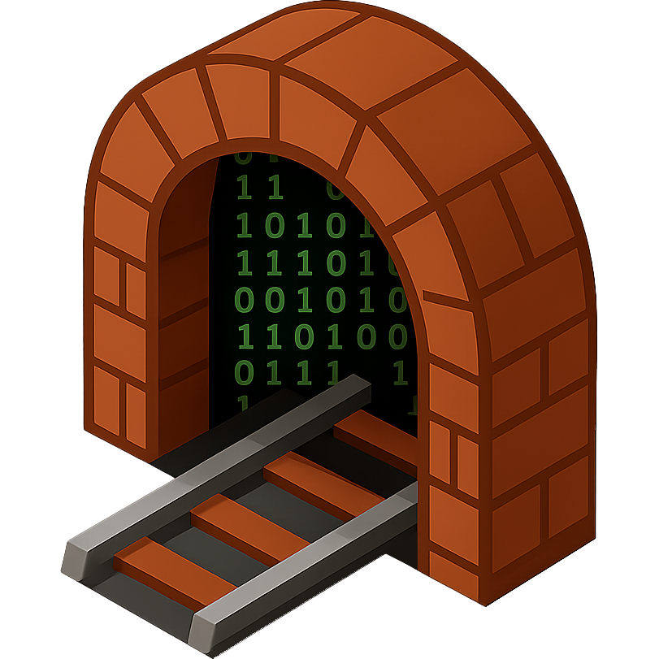

<p style="text-align: center;"></p>

# CCD Tunnel Helper

**CCD Tunnel Helper** is a lightweight app that lets you click `ccd-tunnel://` links in your browser to automatically open SSH tunnels in your terminal.

---

## 📦 Installation

| Platform | Instructions |
|:---------|:--------------|
| **Windows** | Download and run `ccd-tunnel-helper-<version>-win-x64.exe`. |
| **Mac** | Download `ccd-tunnel-helper-<version>-mac-arm64.dmg`, open it, and drag `CCD Tunnel Helper` into `Applications`. |
| **Linux** | Download `ccd-tunnel-helper-<version>-linux-x86_64.AppImage`, make it executable, and run it. |

The app will automatically register the `ccd-tunnel://` protocol on your system.

---

## 🔗 Usage

Once installed, you can click links like:

```html
<a href="ccd-tunnel://connect?user=ccd_devs&host=123.456.789.123&local_port=2025&remote_port=2025&launch=http%3A%2F%2Flocalhost%3A2025%2Fphpmyadmin%2F">Connect to Dev Server</a>
```

The app will open a background tunnel and optionally launch a browser window.

**Supported URL parameters:**

| Parameter    | Description                          |
|:-------------|:-------------------------------------|
| `user`       | SSH username                         |
| `host`       | SSH host IP or DNS name              |
| `local_port` | Local port to bind                   |
| `remote_port`| Remote port to connect               |
| `launch`     | Optional URL to open after tunneling |

Example link:

```html
ccd-tunnel://connect?user=ccd_devs&host=123.456.789.123&local_port=2025&remote_port=2025&launch=http%3A%2F%2Flocalhost%3A2025%2Fphpmyadmin%2F
```

---

## 🧰 Automatic Builds

Releases are built using **GitHub Actions** on every push to `main`.
Each build job produces:

- `ccd-tunnel-helper-<version>-win-x64.exe`
- `ccd-tunnel-helper-<version>-mac-arm64.dmg`
- `ccd-tunnel-helper-<version>-linux-x86_64.AppImage`

These artifacts are bundled into a single **draft GitHub release**, ready for review and publishing.

---

## 💪 Developer Notes

- Built with [Electron](https://electronjs.org) and Node.js.
- Cross-platform binaries created using [`electron-builder`](https://www.electron.build).
- Protocol registration and tray icon handled natively.
- GitHub Actions performs CI builds and assembles the release.

To build locally:

```bash
npm install
npm run build
```

To test the protocol:

```bash
ccd-tunnel://connect?user=me&host=127.0.0.1&local_port=2222&remote_port=22
```

---

Made with ❤️ to help developers connect fast.